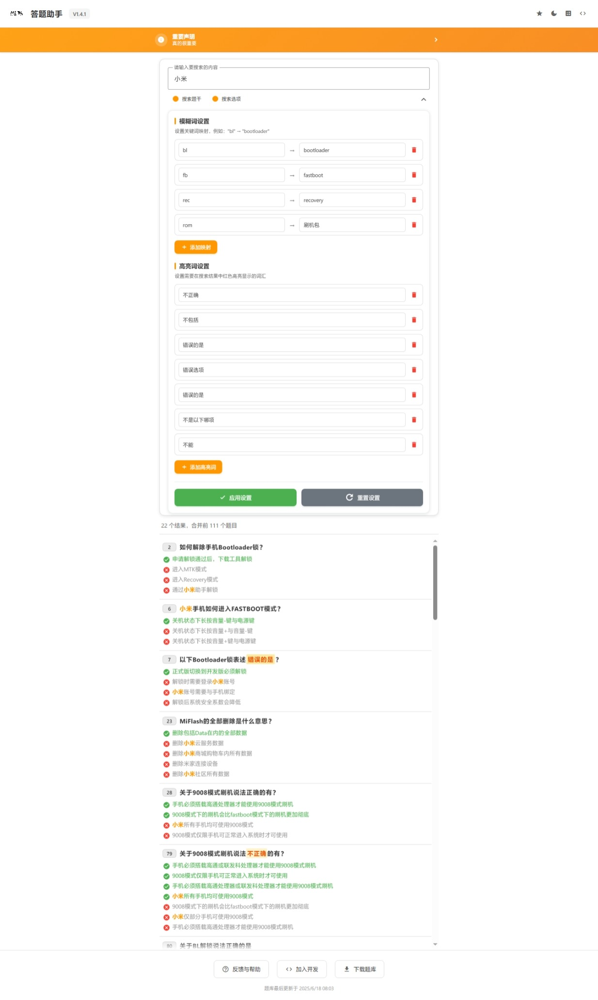
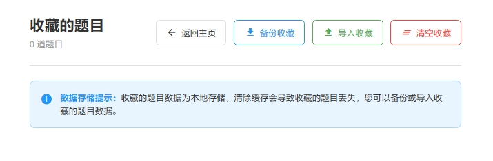
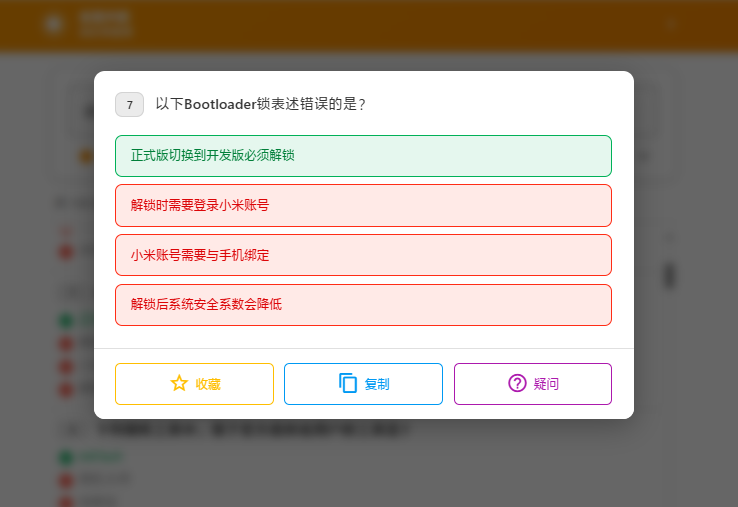
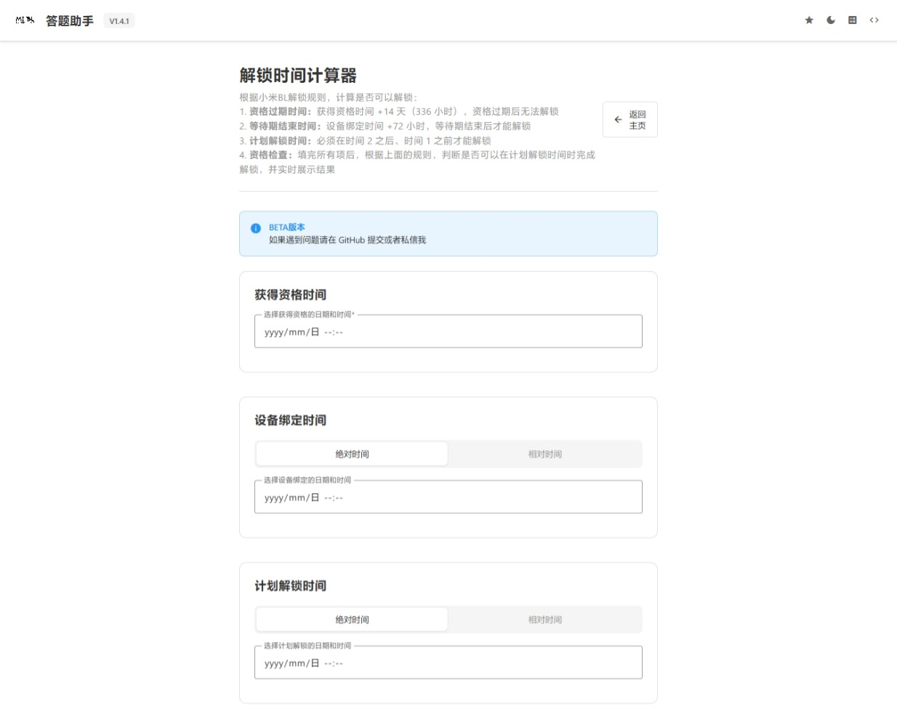

<p align="center"></p>
<h1 align="center"> Xiaomi BL Unlock Helper </h1>
<h3 align="center"> 小米 BL 解锁答题助手 </h3>
<p align="center">一款面向小米手机用户的客户端 Web 应用，助你备考小米解锁 Bootloader 考试，应用支持智能题库搜索、收藏管理和解锁资格计算，且支持离线运行</p>

---

<p align="center">
  <a href="#项目简介">项目简介</a>丨
  <a href="#主要功能">主要功能</a>丨
  <a href="#系统架构">系统架构</a>丨
  <a href="#快速开始">快速开始</a>丨
  <a href="#贡献指南">贡献指南</a>丨
  <a href="#许可协议">许可协议</a>丨
  <a href="#致谢">致谢</a>
</p>

---

## 项目简介

`xiaomi-bl-unlock-helper` 是一个专为准备小米解锁 Bootloader 考试的用户设计的 Web 应用。

它通过集成题库数据，实现模糊搜索、收藏管理以及解锁资格计算功能，支持离线使用，该项目旨在提供轻量、易用且功能丰富的备考工具，帮助用户高效掌握解锁相关知识点。



---

## 主要功能

| 模块名称           | 路径    | 主要脚本        | 作用说明                                                     |
| ------------------ | ------- | --------------- | ------------------------------------------------------------ |
| 题库智能搜索与浏览 | `/`     | `/app/app.js`   | 题库智能搜索与浏览，支持模糊匹配与关键词高亮，快速定位所需题目 |
| 收藏管理           | `/star` | `/star/star.js` | 收藏题目管理与导入导出，方便收藏重要题目，支持浏览器本地持久化及导入导出 |
| 解锁资格计算器     | `/calc` | `/calc/calc.js` | 自动计算解锁资格条件，输入相关信息，自动判断解锁资格是否满足要求 |

---

## 系统架构

> 所有业务逻辑均在浏览器端运行，无需依赖服务器，实现离线支持

### 数据存储

- 题库数据存储在结构化的静态 `JSON` 文件 [questions.json](./data/database/questions.json) 中

- 用户收藏和自定义搜索偏好通过浏览器 `localStorage` 本地保存

  - 收藏数据支持文件导入导出，方便跨设备同步
    

### 开发环境
### 技术栈

```
├─ LICENSE
├─ README.md
├─ _pic
│   ├─ calc.jpeg
│   ├─ home.jpeg
│   ├─ star-2.png
│   └─ star.jpeg
├─ app
│   ├─ app.js
│   └─ material-components-web.min.js
├─ calc
│   ├─ _note.md
│   ├─ calc.js
│   └─ index.html
├─ data
│   └─ database
│       └─ questions.json
├─ favicon.png
├─ index.html
├─ server.py
├─ star
│   ├─ index.html
│   └─ star.js
└─ style
    ├─ main.css
    ├─ material-components-web.min.css
    └─ material-icon-font.woff2
```

#### 前端

- HTML + CSS+ JavaScript


​		Material Design Components (`material-components-web.min.js`)

​		自定义 CSS (`style/main.css`) 实现主题和响应式布局

#### 数据管理

- 静态 JSON 题库 (`questions.json`)

- 浏览器本地存储

- 文件 API 实现收藏导入导出

---

## 快速开始

### 在线使用（推荐）

- **在线访问我们部署在 Cloudflare Pages 的网站：**[bl.lh520.pw](https://bl.lh520.pw)

- 或者使用备用域名：[xiaomi-bl-unlock-helper.pages.dev](https://xiaomi-bl-unlock-helper.pages.dev)

### 离线部署

> 使用下面的方法需要你有 Python 环境，如果你没有，可以自行使用 `node` 等工具开启本地服务器，但不建议直接使用浏览器打开 `index.html`，那可能会导致一些错误

1. 克隆或下载本项目的代码

   ```bash
   git clone https://github.com/YuleBest/xiaomi-bl-unlock-helper.git
   ```

2. 进入项目目录

   ```bash
   cd xiaomi-bl-unlock-helper
   ```

3. 运行部署脚本

   ```bash
   python server.py
   ```

如果一切正常，你会看到类似下面的输出：

```
Server is starting...

- Local access:    http://localhost:8000
- LAN access:      http://198.18.0.1:8000

Press Ctrl+C to stop the server
```

访问给出的网址即可，其中 `LAN` 地址支持局域网内的设备访问（前提是没有开启隔离）

### 使用说明

- 搜索题库：**在主界面的搜索框输入关键词**，下拉栏支持模糊匹配和高亮显示，快速定位目标题目

- 管理收藏：**点击题目的题号**，可以收藏你想重点复习的题目，支持导入导出收藏列表，方便跨设备使用
  

- 资格计算器：根据个人信息和状态，自动计算是否满足小米解锁资格条件
  

---

## 许可协议

本项目采用 MIT 许可证，欢迎自由使用、修改和分发，但禁止商业使用！

**一切倒卖、投诉举报、恶意诋毁的行为都有可能导致本项目立刻删库跑路！！！！**

---

## 贡献指南

欢迎任何形式的贡献！具体贡献流程和规范请查看 [CONTRIBUTING.md](./CONTRIBUTING.md)，无论是报告 Bug、提交代码、更新题库还是改进文档，我们都非常感谢你的参与！

---

## 致谢

- Google Material Components for the Web (https://github.com/material-components/material-components-web)，使用 MIT 许可证

---

祝你备考顺利，早日解锁你的小米设备 Bootloader！
